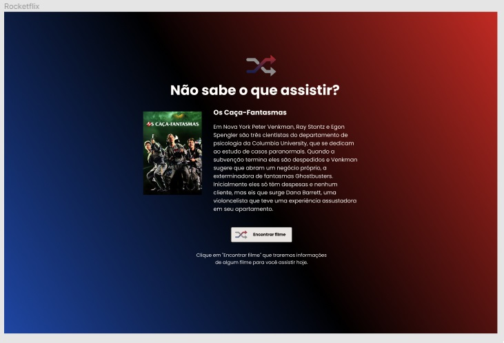
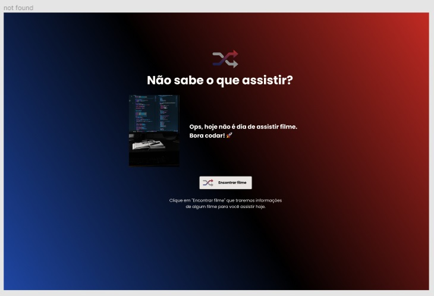
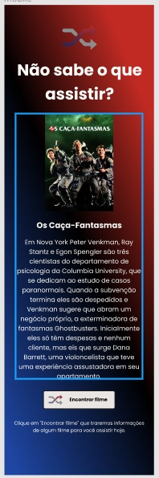

## 💻 Rocketflix

Nesse projeto o objetivo é consumir uma api e exibir em um frontend.

### 💡 Desafio Rocketflix

---


Deverá utilizar a API do [themoviedb.org](http://themoviedb.org/) para exibir um filme aleatório sempre que clicar em Encontrar Filme utilizando um template determnado.

### 🎨 Style Guide

---

**Cores** 

```css
:root {
  --title: #fffcf9;
  --subtitle: #b3b3b3;
  --bg-button: #e9e6e3;
  --background: linear-gradient(43deg, #102d71 0%, #000000 52%, #c12a23 100%);
}
```

**Fonte**

- font-family: Poppins 
- font-weight: 300, 400 e 500
- Você pode encontrar a fonte no [Google Fonts](https://fonts.google.com/) 

### 🚀 Layout

---

- Consultar e atender o layout do projeto no [Figma](https://www.figma.com/file/9HFoO4wNB150gRSV4v0Qse/DD-%2F-Rocketflix/duplicate).
- Utilizar os assets em `src/assets` para os detalhes do layout.
- Se precisar de mais informações, consultar o [Notion](https://www.notion.so/Desafio-Rocketflix-5ca1c56b5e52473eb12e8b2bc3ab1b8d). 

<p align="center" style="display: flex; align-items: flex-start; justify-content: center;"> 
   
   
   
   
</p> 

### 🚀 Techs

---

- HTML
- CSS
- JavaScript

### ✅ Construindo o projeto

---

- [x] Criar uma conta no [https://www.themoviedb.org/signup](https://www.themoviedb.org/signup)
- [x] Após verificar o e-mail, faça o login e [acesse este link](https://www.themoviedb.org/settings/api/request)
- [x] Clicar em Criar e escolha a opção Developer

- [x] Aceitar os termos de uso da API
- [x] Preencher os dados necessários e clique em Enviar.

- [x] Após clicar em enviar você terá acesso a sua API Key

- [x] Após baixar o template terá um arquivo chamado `api.example`, cole a sua API KEY gerada no arquivo e renomeie o arquivo para `api.js`
- [x] Adicionar a lógica do desafio no arquivo `main.js`
- [x] Informações da API: data.results
````javascript
    /**
     * original_title: "Blacklight"
     * title: "Spider-Man: No Way Home"
     * overview: "Travis Block is a shadowy Government agent who specializes in removing operatives whose covers have been exposed. He then has to uncover a deadly conspiracy within his own ranks that reaches the highest echelons of power."
     * popularity: 13287.383
     * poster_path: "/1g0dhYtq4irTY1GPXvft6k4YLjm.jpg"
     * backdrop_path: "/isBUqT3hGKvzIoiGcVzURh1EdvQ.jpg"
     */
````

**Requisitos para o desafio:**

- [ ] Consumir a API do [https://www.themoviedb.org/](https://www.themoviedb.org/)
- [ ] Ter um botão que traga um filme aleatório com poster e descrição do filme.
- [ ] Se o filme não existir, apresente uma mensagem e imagem informando que o filme não está disponível.

**Se desafie também:**

- [ ] Tornando o site responsivo
- [ ] Exibindo mais informações sobre os filmes que vem da API (Data de lançamento, atores...)

🚀 Bora codar! Lembre-se que você pode usar as tecnologias que se sentir mais confortável, mas também pode se desafiar usando novas techs, fazendo modificações e/ou adicionando funcionalidades no projeto como preferir. 🚀

### 📅 Referências

---

Para construir esse projeto, na trilha Discover há diversas referências que irão contribuir na realização dessa tarefa.

- [O Guia estelar de HTML](https://app.rocketseat.com.br/node/o-guia-estelar-de-html)
- [O Guia estelar de CSS](https://app.rocketseat.com.br/node/o-guia-estelar-de-css)
- [O Guia estelar de JavaScript](https://app.rocketseat.com.br/node/o-guia-estelar-de-java-script)
- [Posicionando Foguetes](https://app.rocketseat.com.br/node/posicionando-foguetes)
- [Pilotando com a DOM](https://app.rocketseat.com.br/node/pilotando-com-a-dom)

E também, há esses vídeos que podem ajudar

- [API ajax fetch axios](https://youtu.be/vYlz3SmNXQQ)
- [O DOM é um objeto js](https://youtu.be/UftSB4DaRU4)
- [Consumir api com axios](https://youtu.be/VM4e37DaskU)

---

Feito com 💜 por @douglasabnovato 👋 Contato no Linkedin [de portas abertas](https://www.linkedin.com/in/douglasabnovato/)!
